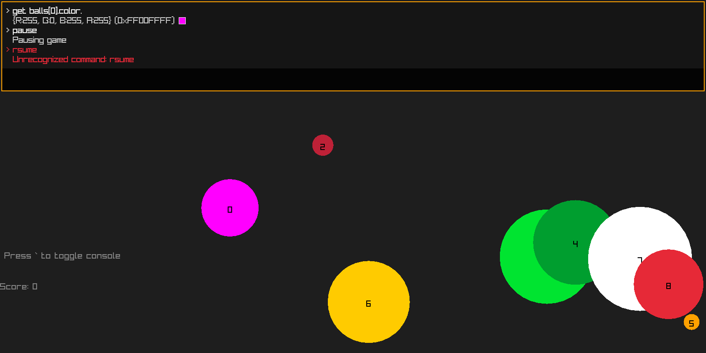

# consolme
Single header Raylib debug console implementation in C.

## Features
- **Single Header**
- **Customizable**
- **Autocompletion**
- **Key binds**
- **Extensions**
    - *CMyReflection*: Reflection library for c
